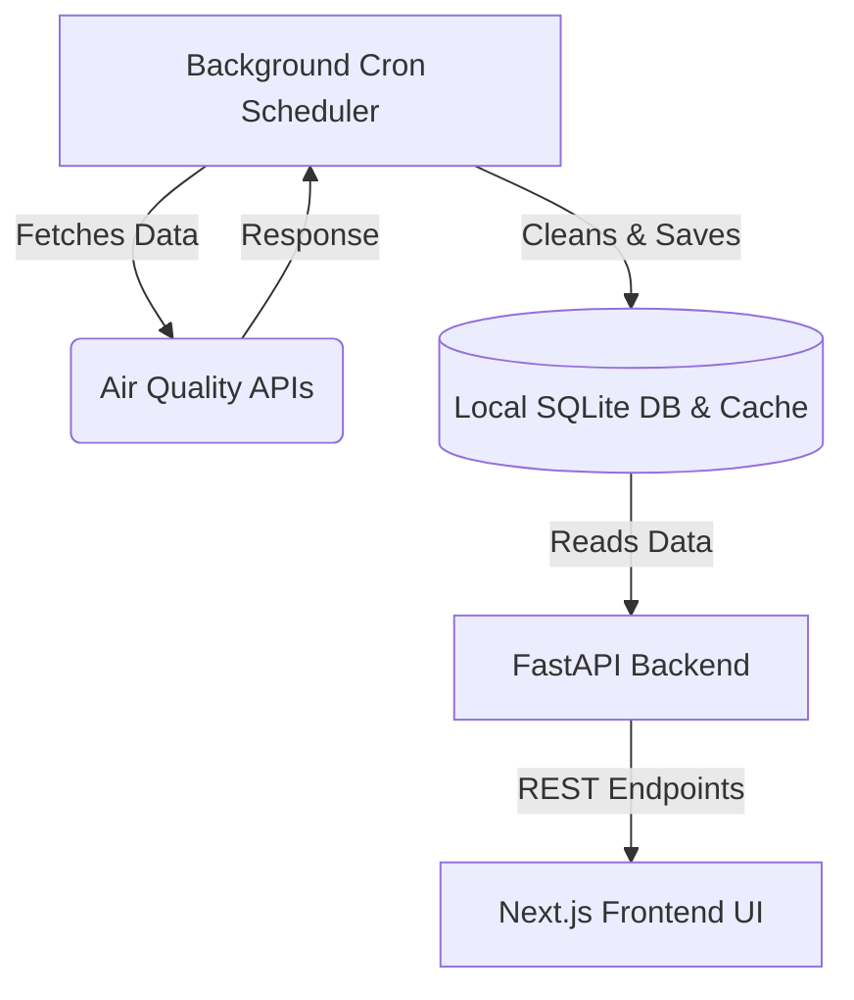
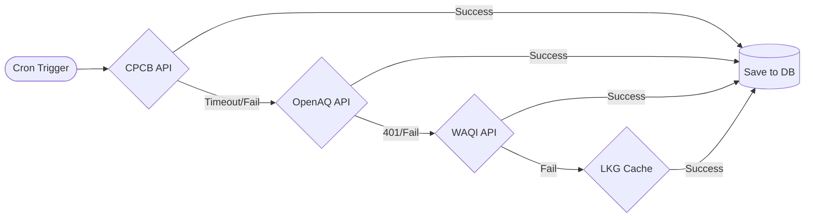
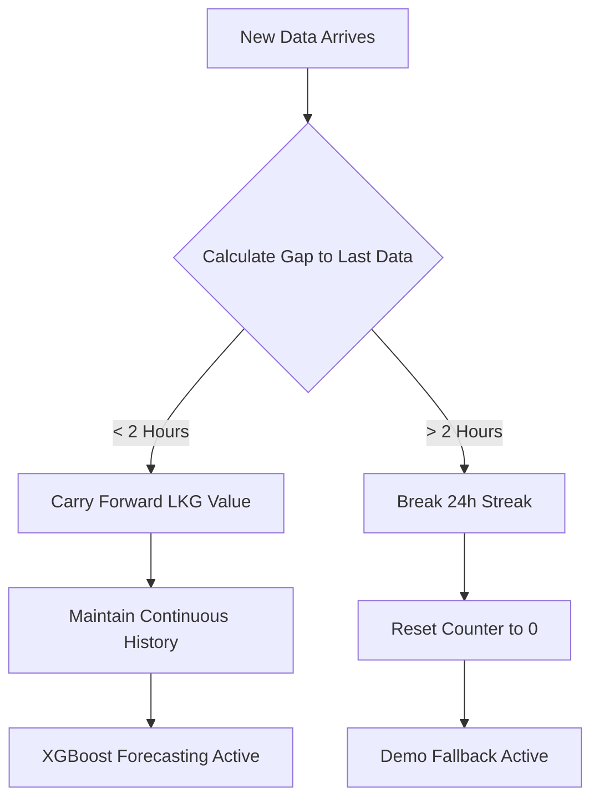

# VayuSangam: System Architecture & Technical Documentation

This document outlines the core architecture, data pipelines, and design philosophies of the **VayuSangam** Air Quality Monitoring and Forecasting project. The system is designed to be highly resilient, prioritizing **honest data** over synthetic approximations, while ensuring the user interface remains smooth and crash-free even during severe upstream API outages.

---

## 1. High-Level Architecture

VayuSangam is split into three main decoupled components:

1. **Frontend (Next.js)**: A highly interactive, dynamic UI that visualizes AQI data, Nowcast maps, and Interactive Reports. It never touches raw APIs directly.
2. **Backend (FastAPI)**: Serves clean, structured data to the frontend via REST endpoints. It reads from local SQLite databases and cached JSON/NetCDF files.
3. **Background Cron Scheduler (`cron_scheduler.py`)**: The true workhorse. It runs completely independently of the FastAPI server, waking up every 15 minutes to fetch, clean, and store live data. 

> [!NOTE]
> By decoupling the fetcher (Cron) from the server (FastAPI), the user interface is extremely fast. The frontend never waits for a slow API call to CPCB; it only reads the pre-processed results.

---

## 2. The "Smooth Fallback" Mechanism (Zero-Crash Policy)

External Air Quality APIs (especially government servers) are notorious for downtime, rate limits, and timeouts. VayuSangam handles this gracefully using a multi-tiered fallback architecture.

When the Cron job wakes up, it attempts to fetch data in this exact order:
1. **Primary Source (CPCB API)**: The official government data source. (Prone to timeouts).
2. **Fallback 1 (OpenAQ)**: A reliable global open-source aggregator.
3. **Fallback 2 (WAQI / AQICN)**: A robust global index API.
4. **Fallback 3 (Last Known Good - LKG)**: If the internet is completely down, the system reads the last successful fetch from its own local cache (`cpcb_cache.csv`).

### Why is this important?
If CPCB goes down, the system automatically and silently switches to WAQI. The frontend doesn't crash, the map doesn't go blank, and the user experiences zero interruption. 

---

## 3. AQI & PM2.5 Data Processing: Map vs. Reports

We handle AQI data differently depending on the visual context to balance aesthetics with strict accuracy.

* **Live Map (Nowcast Grid)**: The map uses an AI Spatial Interpolation algorithm called **IDW (Inverse Distance Weighting)**. If we only have data for Delhi, the algorithm mathematically estimates the air quality for surrounding regions (like Gurugram or Noida) based on wind and proximity. This ensures the map looks fully populated, smooth, and visually complete.
* **Interactive Reports**: Reports rely on **Strict Raw Data**. There is no guessing or interpolation here. If the active API (e.g., WAQI) does not return data for Gurugram, the bar chart for Gurugram will honestly show `0` or remain blank. 

---

## 4. Real Data Over Fake Data (Honest AI Philosophy)

Our Machine Learning Forecasting model (XGBoost) requires a continuous, unbroken chain of historical data (specifically `t-1`, `t-3`, and `t-24` lags) to predict the future AQI accurately. 

**The Rule of Honesty:**
* **Small Gaps (≤ 2 hours)**: The system will carry forward the last known value to patch minor network hiccups.
* **Large Gaps (> 2 hours)**: If the server is shut down for 8 hours, we **do not** fabricate 8 hours of fake data. Doing so would confuse the AI model, making it think 8-hour-old data is fresh, resulting in garbage predictions.
* **Streak Breaking**: Instead, the system honestly breaks the 24-hour streak. It accepts that the data is `insufficient` and switches the Forecast module to a **Demo/Synthetic Fallback Model** until a fresh, continuous 24-hour chain of real data is naturally collected again.

> [!IMPORTANT]
> **Rolling Window Database**: We never bulk-delete the historical SQLite database. The cron job runs a `cleanup_old_history(max_hours=48)` function every 15 minutes. It only drops rows older than 48 hours, acting as a continuous, self-cleaning rolling window.

---

## 5. Crontab & Government API Fallback Mechanism

A dedicated background **crontab scheduler** is responsible for constantly fetching air quality data from government APIs every 15 minutes. This completely shields the user interface from slow API response times.

However, government APIs are notoriously prone to prolonged outages. If the government side fails and the crontab is unable to fetch data for an extended period:
1. **No ML Corruption**: The system refuses to fabricate data to fill the gap.
2. **Graceful UI Degradation**: The UI gracefully falls back to showing **Demo/Synthetic Data** instead of crashing, hanging, or showing wildly inaccurate ML predictions based on stale data.
3. **Automatic Recovery**: The crontab continues to ping the government APIs in the background. Once the APIs come back online and the crontab successfully collects a fresh, unbroken 24-hour history from the **last good fetch**, the system seamlessly shifts the UI back to 100% Real Live ML Predictions.

This ensures the user always has a smooth, fully-functional interface, even during complete government API blackouts.

---

## 6. API Key Management

We tackle API key management securely and dynamically:
* All keys are stored securely in a `.env` file (e.g., `CPCB_API_KEY`, `WAQI_API_KEY`, `OPENAQ_API_KEY`).
* The system checks the validity of keys at runtime. If an API key throws a `401 Unauthorized` (e.g., OpenAQ key expires), the system catches the error, logs it in `ingestion.log`, and immediately jumps to the next available fallback (WAQI).
* No hardcoded keys exist in the python logic, ensuring enterprise-grade security.

---

## 7. Future Improvements

To further enhance the robustness and scalability of VayuSangam, the following improvements are planned:

1. **Dynamic Data Imputation (Bridging Long Gaps)**: Instead of strictly breaking the 24h historical streak for >2 hour server outages, implement advanced machine learning imputation (e.g., ARIMA or Polynomial Interpolation). This would mathematically estimate the missing 8-hour gap, allowing the XGBoost forecast model to run 24/7 without ever falling back to the Demo Model.
2. **Real-Time WebSocket Updates**: Upgrade the architecture from REST API polling to WebSockets. The moment the background cron job writes fresh data to the SQLite database, the backend could push the live update directly to all active Next.js frontend clients.
3. **Enterprise Database Migration**: Transition from a local rolling-window SQLite database to a robust **PostgreSQL + PostGIS** database. This would allow VayuSangam to store years of historical data for the entire country instead of just maintaining a 48-hour buffer for Delhi-NCR.
4. **Parallel API Aggregation**: Instead of sequential fallbacks (CPCB -> OpenAQ -> WAQI), implement parallel async fetching. The system could query all three APIs simultaneously and intelligently merge their responses (e.g., taking Delhi from WAQI and Gurugram from OpenAQ) to build a "Super-Dataset" in a fraction of the time.

---

## Summary

VayuSangam is built like a tank. It survives API crashes via multi-tiered fallbacks, prevents ML corruption by strictly prioritizing honest continuous data over fabricated history, and keeps the user interface incredibly fast by offloading all heavy lifting to an independent background cron job.
