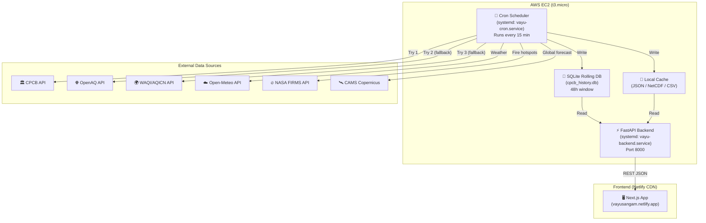
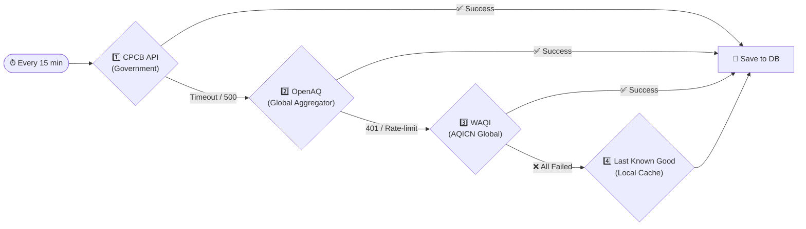
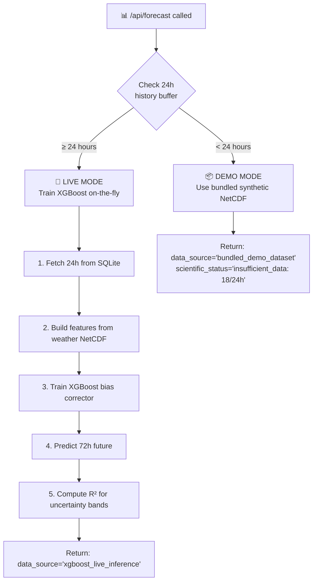
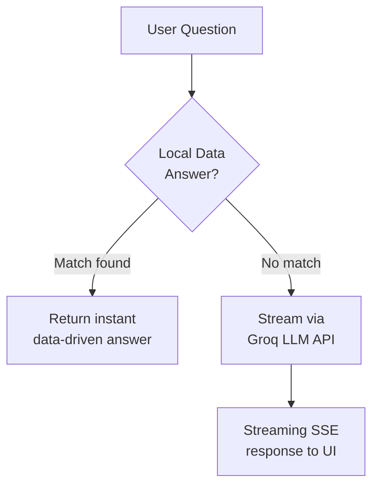

# VayuSangam: System Architecture & Technical Documentation

> **Core Philosophy: Truth over Fabricated.**
> If the AQI is 500, we show 500. No temporal smoothing, no hidden averaging, no sanitised numbers.

---

## Table of Contents

1. [High-Level Architecture](#1-high-level-architecture)
2. [Deployment Topology](#2-deployment-topology)
3. [Independent Crontab & Multi-Tier API Fallback](#3-independent-crontab--multi-tier-api-fallback)
4. [Data Sources & Fetcher Pipeline](#4-data-sources--fetcher-pipeline)
5. [Rolling Window Database (24h History Buffer)](#5-rolling-window-database-24h-history-buffer)
6. [ML Forecasting Pipeline (XGBoost Live Inference)](#6-ml-forecasting-pipeline-xgboost-live-inference)
7. [SHAP Explainability Engine](#7-shap-explainability-engine)
8. [Scenario Engine (What-If Policy Simulator)](#8-scenario-engine-what-if-policy-simulator)
9. [Inversion Intelligence Engine (Atmospheric Trapping Index)](#9-inversion-intelligence-engine-atmospheric-trapping-index)
10. [Source Intelligence Engine (Fire Clustering & Transport)](#10-source-intelligence-engine-fire-clustering--transport)
11. [CAMS Global Cross-Validation](#11-cams-global-cross-validation)
12. [Map & Spatial Interpolation (IDW Grid)](#12-map--spatial-interpolation-idw-grid)
13. [Reports Module (Strict Raw Data)](#13-reports-module-strict-raw-data)
14. [Vayu AI Chatbot (LLM + Local Data Hybrid)](#14-vayu-ai-chatbot-llm--local-data-hybrid)
15. [Indian CPCB AQI Calculation Standard](#15-indian-cpcb-aqi-calculation-standard)
16. [Honest Data Policy (Anti-Fabrication Rules)](#16-honest-data-policy-anti-fabrication-rules)
17. [API Key Management & Security](#17-api-key-management--security)
18. [Technology Stack Summary](#18-technology-stack-summary)
19. [File Structure Reference](#19-file-structure-reference)
20. [Future Improvements](#20-future-improvements)

---

## 1. High-Level Architecture

VayuSangam is split into three completely **decoupled** components that run independently:

| Component | Technology | Role |
|---|---|---|
| **Frontend** | Next.js (React) | Interactive UI — maps, charts, reports, chatbot. Never touches raw APIs. |
| **Backend** | FastAPI (Python) | REST API layer. Reads pre-processed data from local DB/cache. Serves clean JSON. |
| **Cron Scheduler** | Python `schedule` + systemd | Background daemon. Fetches, cleans, and stores live data every 15 minutes. |

> **Why decouple?** The frontend never waits for a slow government API call. It only reads pre-processed results from the backend, which in turn reads from local storage. The user experiences sub-100ms response times regardless of upstream API health.



---

## 2. Deployment Topology

| Layer | Service | Where | Details |
|---|---|---|---|
| **Frontend** | Next.js SSR | Netlify CDN | Auto-deployed from GitHub `main` branch. `netlify.toml` defines build config. |
| **Backend API** | FastAPI + Uvicorn | AWS EC2 `t3.micro` (54.226.71.16:8000) | Runs as `vayu-backend.service` (systemd). Auto-restarts on crash. |
| **Cron Fetcher** | Python `schedule` loop | Same AWS EC2 | Runs as `vayu-cron.service` (systemd). Completely independent of the API server. |
| **Database** | SQLite | Same AWS EC2 (`/home/ubuntu/backend/data/live/cpcb_history.db`) | Self-cleaning 48h rolling window. |
| **ML Models** | XGBoost `.joblib` files | Same AWS EC2 (`/home/ubuntu/backend/data/ml/`) | Pre-trained on CPCB 2015–2020 data. Loaded once at server startup. |

### systemd Services

```ini
# /etc/systemd/system/vayu-backend.service
[Service]
ExecStart=/home/ubuntu/venv/bin/uvicorn backend.app.main:app --host 0.0.0.0 --port 8000
EnvironmentFile=/home/ubuntu/.env
Restart=always
RestartSec=10

# /etc/systemd/system/vayu-cron.service
[Service]
ExecStart=/home/ubuntu/venv/bin/python -u backend/scripts/cron_scheduler.py
Restart=always
RestartSec=10
```

Both services are `enabled` (auto-start on reboot) and `always` restart on failure.

---

## 3. Independent Crontab & Multi-Tier API Fallback

The cron scheduler (`cron_scheduler.py`) runs as a completely independent background daemon. It wakes up every **15 minutes** and attempts to fetch air quality data using a strict priority waterfall:



### Failure Tracking & Alerting

The cron tracks consecutive failures using a simple streak file (`failed_streak.txt`). After **3 consecutive failures**, it writes a `CRITICAL_ALERT.txt` file that the API layer can surface to the frontend.

```
backend/data/live/failed_streak.txt  → "3"
backend/data/live/CRITICAL_ALERT.txt → "CRITICAL: CPCB fetch failed 3 times consecutively!"
```

On a successful fetch, both files are deleted (streak reset).

### Other Scheduled Jobs

| Job | Frequency | Source |
|---|---|---|
| CPCB/OpenAQ/WAQI fetch | Every 15 min | Government / Global AQI APIs |
| Open-Meteo Weather fetch | Every 6 hours | Open-Meteo (temperature, wind, PBLH, humidity) |
| NASA FIRMS fire hotspots | Every 12 hours | NASA FIRMS VIIRS satellite |
| Sentinel-5P HCHO | Every 12 hours | Google Earth Engine |

---

## 4. Data Sources & Fetcher Pipeline

Each fetcher is a standalone Python script in `backend/fetchers/`:

| File | Source | Data | Format |
|---|---|---|---|
| `fetch_cpcb.py` | CPCB (data.gov.in) + OpenAQ + WAQI | PM2.5, PM10 (multi-city NCR) | SQLite DB rows |
| `fetch_weather.py` | Open-Meteo API | Temperature, Wind U/V, PBLH, RH (72h forecast grid) | NetCDF (`weather_live.nc`) |
| `fetch_firms.py` | NASA FIRMS VIIRS | Active fire hotspots (lat/lon/FRP/confidence) | CSV (`fires_live.csv`) |
| `fetch_cams.py` | Copernicus CAMS (ADS API) | Global PM2.5 forecast (coarse grid) | NetCDF (`cams_live.nc`) |
| `fetch_aod.py` | MODIS (via GEE) | Aerosol Optical Depth | NetCDF |
| `fetch_hcho.py` | Sentinel-5P (via GEE) | HCHO formaldehyde hotspots | GeoJSON (`hcho_hotspots.geojson`) |
| `fetch_satellite_no2.py` | Sentinel-5P | NO₂ column density | NetCDF |
| `sources.py` | WAQI bounding-box API | Station-level AQI for map | JSON (internal) |

### Multi-Source Fallback in `fetch_cpcb.py`

The CPCB fetcher implements the waterfall internally:

1. **CPCBSource** → `data.gov.in` API with government API key
2. **OpenAQSource** → `api.openaq.org` with bearer token
3. **WAQISource** → `api.waqi.info` map bounds query (5 bounding boxes: Delhi, Gurugram, Noida, Ghaziabad, Faridabad)

Each source implements a common `fetch() → list[dict]` contract. The fetcher tries them in order and stops at the first success.

---

## 5. Rolling Window Database (24h History Buffer)

**File:** `backend/scripts/cpcb_history_store.py`
**Database:** `backend/data/live/cpcb_history.db` (SQLite)

### Schema
```sql
CREATE TABLE readings (
    timestamp TEXT,    -- ISO 8601 (e.g., '2026-09-21T04:00')
    city TEXT,         -- e.g., 'Delhi', 'Gurugram'
    pm25 REAL,         -- µg/m³
    pm10 REAL,         -- µg/m³
    source TEXT         -- 'cpcb', 'openaq', 'waqi'
);
```

### Self-Cleaning Rolling Window

Every 15 minutes, the cron job runs `cleanup_old_history(max_hours=48)` which deletes all rows older than 48 hours. This ensures the database never grows unbounded.

### Lag Feature Extraction

The ML model needs temporal lag features. The function `get_lag_features(target_time)` extracts:

| Feature | Description |
|---|---|
| `pm25_lag1h` | PM2.5 reading 1 hour ago |
| `pm25_lag3h` | PM2.5 reading 3 hours ago |
| `pm25_lag24h` | PM2.5 reading 24 hours ago |

If any lag is missing (gap in data), the function returns a string error instead of a dict — this is the signal for the ML pipeline to fall back to Demo mode.

### History Count Check

`get_history_count()` returns:
```python
{"status": "sufficient", "valid_observations": 24}   # → Live ML mode
{"status": "insufficient", "valid_observations": 18}  # → Demo fallback
```

The threshold is **24 continuous hourly observations**. Below this, the system refuses to run live ML predictions.

---

## 6. ML Forecasting Pipeline (XGBoost Live Inference)

**File:** `backend/app/live_inference.py`

### The Dynamic Runtime Switch



### Training Features (BiasCorrectionFeatureBuilder)

The XGBoost model trains on **8 features** extracted from each hourly timestep:

| Feature | Source | Unit |
|---|---|---|
| `raw_pm25` | NetCDF forecast grid (spatial mean) | µg/m³ |
| `raw_o3` | NetCDF forecast grid (spatial mean) | µg/m³ |
| `temperature_c` | Open-Meteo `t2` variable (K → °C) | °C |
| `wind_speed_mps` | `√(u² + v²)` from Open-Meteo | m/s |
| `pblh_m` | Planetary Boundary Layer Height | m |
| `relative_humidity_pct` | Open-Meteo `rh` | % |
| `hour_of_day` | Timestamp extraction | 0–23 |
| `fire_indicator` | Stubble fraction (0.0–1.0) | ratio |

### XGBoost Hyperparameters

```python
XGBRegressor(
    n_estimators=100,
    max_depth=4,
    learning_rate=0.05,
    objective="reg:squarederror"
)
```

### Uncertainty Bands (Priority-3 Formula)

After training, we compute the in-sample R² score. The uncertainty band is:

```
AQI_upper = AQI_predicted × (1 + (1 - R²))
AQI_lower = AQI_predicted × (1 - (1 - R²))
```

Higher R² → tighter bands → higher confidence.

### Pre-trained Models (Offline)

Two `.joblib` files are pre-trained on **CPCB 2015–2020** real observation data:

| File | Target | Held-out Test R² |
|---|---|---|
| `xgb_pm25.joblib` | PM2.5 (µg/m³) | 0.97 |
| `xgb_aqi.joblib` | AQI (unitless) | 0.97 |

These are used for SHAP explainability and scenario corrections. The live inference also trains a lightweight on-the-fly corrector using the last 24h of real sensor data.

---

## 7. SHAP Explainability Engine

**File:** `backend/app/ml_explainer.py`

Uses `shap.TreeExplainer` on the pre-trained XGBoost model to attribute PM2.5 predictions to individual features.

### How it works

1. Load `xgb_pm25.joblib` + `xgb_aqi.joblib` (cached singleton).
2. Build a single-row feature DataFrame from current weather + fire data + lag features.
3. Run `TreeExplainer.shap_values()` → get per-feature SHAP contributions.
4. Sort by absolute SHAP value → return top 6 drivers.

### Output Example

```json
{
    "model": "XGBoostAQIPredictor",
    "top_drivers": [
        {"feature": "pm25_lag1h", "shap": +42.31, "direction": "increase"},
        {"feature": "pbl_height_m", "shap": -18.72, "direction": "decrease"},
        {"feature": "fire_frp_sum_24h", "shap": +12.05, "direction": "increase"}
    ],
    "base_value_pm25": 85.3,
    "prediction": {"pm25_ug_m3": 163.1, "aqi": 322}
}
```

### Frontend Rendering

The frontend renders SHAP drivers as:
- 🌬️ **Mausam (Hawa band hai)** → when PBLH/wind features dominate
- 🔥 **Parali (Dhuaa idhar aa raha hai)** → when fire features dominate
- 🚗 **Local Pollution (Traffic/Dust)** → when PM2.5 lag features dominate

---

## 8. Scenario Engine (What-If Policy Simulator)

**File:** `backend/app/scenario_engine.py`

Simulates the effect of a hypothetical stubble-burning reduction on Delhi's air quality.

### Input
```
stubble_reduction: 0.0 (no change) → 1.0 (100% ban on farm fires)
hour: 0 → 72 (forecast hour)
```

### Mechanism

1. Run `DemoForecastModel.predict(stubble_fraction=1.0)` → **Baseline** (current reality)
2. Run `DemoForecastModel.predict(stubble_fraction=1-reduction)` → **Scenario** (policy applied)
3. If XGBoost model exists, override PM2.5 with ML-corrected prediction
4. Compute Indian CPCB AQI sub-indices for both baseline and scenario
5. Return the delta (drop in AQI, PM2.5, PM10)

### What Gets Scaled

| Pollutant | Scaled by stubble_fraction? | Reason |
|---|---|---|
| PM2.5 | ✅ Yes | Direct combustion product |
| PM10 | ✅ Yes | Direct combustion product |
| O3 | ❌ No | Photochemical — depends on meteorology, not direct burning |

> The system explicitly documents this limitation in every API response via a `note` field.

### AQI Calculation

Uses the **Indian CPCB National Air Quality Index (2014)** standard with piecewise linear interpolation across official breakpoints. The final AQI is the **maximum sub-index** across PM2.5, PM10, and O3 — the dominant pollutant is identified and returned.

---

## 9. Inversion Intelligence Engine (Atmospheric Trapping Index)

**File:** `backend/app/inversion_intelligence.py`

Computes a composite **Atmospheric Trapping / Inversion Index** (0.0 to 1.0) per forecast hour using 4 meteorological variables:

### Components & Weights

| Component | Variable | Weight | Bad Condition (score → 1.0) | Good Condition (score → 0.0) |
|---|---|---|---|---|
| PBLH Norm | Planetary Boundary Layer Height | 40% | Shallow (< 200m) → pollution trapped | Deep (> 1500m) → pollution disperses |
| Wind Norm | Wind speed (√(u²+v²)) | 30% | Calm (< 1 m/s) → no dispersion | Strong (> 6 m/s) → good dispersion |
| Stability Proxy | 2m Temperature (K) | 20% | Cold (< 10°C) → stable atmosphere | Hot (> 35°C) → convective mixing |
| RH Norm | Relative Humidity | 10% | High (> 85%) → haze/fog suppresses mixing | Low (< 30%) → clear conditions |

### Inversion Categories

| Index Range | Category | Meaning |
|---|---|---|
| < 0.25 | Weak | Good dispersion, pollution clears quickly |
| 0.25 – 0.50 | Moderate | Some trapping, AQI may rise overnight |
| 0.50 – 0.75 | Strong | Significant trapping, smog likely |
| ≥ 0.75 | Severe | Extreme trapping, emergency-level smog risk |

### Data Source Selection

The engine automatically prefers `weather_live.nc` (from Open-Meteo, refreshed every 6h) if it exists and is less than 6 hours old. Otherwise, it falls back to `wind_demo.nc` (bundled synthetic data).

---

## 10. Source Intelligence Engine (Fire Clustering & Transport)

**File:** `backend/app/source_intelligence.py`

Identifies and ranks the most likely **fire-source clusters** that could be transporting pollution toward Delhi.

### Pipeline

1. **Load fire hotspots** → CSV from NASA FIRMS VIIRS satellite
2. **DBSCAN clustering** → Group nearby fires using great-circle (Haversine) distance
   - `epsilon_km = 25` (fires within 25 km = same cluster)
   - `min_samples = 3`
   - Custom O(n²) implementation — no sklearn dependency needed for demo-scale data
3. **Score each cluster** using a weighted composite:

| Factor | Weight | Source |
|---|---|---|
| Normalised FRP (Fire Radiative Power) | 30% | NASA FIRMS |
| HCHO anomaly (formaldehyde) | 20% | Sentinel-5P via GEE |
| NO₂ satellite | 15% | Sentinel-5P (Phase 2) |
| Wind alignment score | 15% | Open-Meteo wind vectors |
| Proximity to Delhi | 10% | Haversine distance |
| Agricultural land fraction | 10% | Config (stub for Phase 2) |

4. **Wind alignment** → Compute bearing from fire cluster to Delhi NCR centre (28.61°N, 77.21°E). Compare with wind travel direction. `cos(angle_difference)` gives alignment score (1.0 = wind blows fire smoke directly toward Delhi).

5. **Travel time estimate** → `distance_km / (wind_speed_mps × 3.6)` with ±30% uncertainty band.

6. **HCHO attribution** → Cross-reference HCHO formaldehyde hotspots (from Google Earth Engine Sentinel-5P) with fire clusters using a 50 km radius + wind direction check (≤30° cone).

---

## 11. CAMS Global Cross-Validation

**File:** `backend/fetchers/fetch_cams.py`

### What is CAMS?

CAMS (Copernicus Atmosphere Monitoring Service) is a European satellite-based global atmospheric model. It provides a coarse-resolution (~40 km) global PM2.5 forecast.

### Why we compare against it

We show a side-by-side comparison between our local AI prediction and the CAMS global prediction. This visually proves why hyper-local AI is necessary:

| | Local XGBoost | CAMS Global |
|---|---|---|
| Resolution | Station-level (~1 km) | ~40 km grid cell |
| PM2.5 (example) | 163.1 µg/m³ | 25 µg/m³ |
| Captures local events | ✅ Fire spikes, traffic, inversions | ❌ Misses localized smog |
| Speed | Milliseconds | Hours (on supercomputers) |

### Agreement Score

```
Agreement% = max(0, 100 - |Local_PM25 - CAMS_PM25| / max(Local_PM25, CAMS_PM25) × 100)
```

A low agreement score (e.g., 0%) proves the global model is dangerously underestimating local pollution.

### Downscaling (Future)

The system attempts to train a statistical downscaling model that learns to correct CAMS using local sensor history. This requires 24–48h of continuous paired data to train. The "Waiting for history to train downscaling" message indicates this process is accumulating data.

---

## 12. Map & Spatial Interpolation (IDW Grid)

### Algorithm: Inverse Distance Weighting (IDW)

The map doesn't just plot raw sensor pins. It generates a **dense spatial grid** covering the entire Delhi-NCR region using IDW interpolation:

```
Estimated_Value(x, y) = Σ(Value_i × w_i) / Σ(w_i)
where w_i = 1 / distance(x, y, station_i)^p
```

- `p = 2` (squared distance weighting — closer stations have much more influence)
- Grid resolution: configurable (default ~500m cells)

### Why IDW?

Even if only 3 out of 11 government sensors are reporting data, the map remains fully populated. Every pixel on the map gets an estimated value based on the nearest real sensors. This ensures the map never shows blank areas.

### Visual Layers

| Layer | Data | Visualization |
|---|---|---|
| AQI Heatmap | IDW interpolated AQI | Color gradient (green → red → maroon) |
| PM2.5 Heatmap | IDW interpolated PM2.5 | Color gradient |
| PBLH Overlay | From weather NetCDF | Contour/gradient (shows trapping zones) |
| Active Fires | NASA FIRMS hotspots | Red markers with FRP-based size |
| Wind Vectors | Open-Meteo u/v | Animated directional arrows |

---

## 13. Reports Module (Strict Raw Data)

Unlike the map (which interpolates), the **Reports page** uses **strict raw data only**.

| Rule | Map | Reports |
|---|---|---|
| Interpolation | ✅ IDW fills gaps | ❌ No interpolation |
| Missing city | Shows estimated value | Shows blank / 0 |
| Estimated tag | None needed | `≈ Estimated` badge if interpolated |

If a city's sensors were offline and the system had to interpolate, the Reports page honestly tags that row with an **"≈ Estimated"** badge. We never pass off an AI estimate as a raw sensor reading.

---

## 14. Vayu AI Chatbot (LLM + Local Data Hybrid)

**Endpoint:** `POST /api/chat`

### Two-Tier Answer System



### Tier 1: Local Data Answers (No LLM needed)

The chatbot first checks if the question can be answered from live dashboard data:

| Question Pattern | Data Source |
|---|---|
| "current AQI", "abhi AQI kitna hai" | `/api/forecast` endpoint |
| "fire sources", "parali kahan jal rahi hai" | `/api/sources` endpoint |
| "inversion", "trapping" | `/api/inversion` endpoint |

This means **data questions work even without an API key** — they're answered purely from local backend data.

### Tier 2: Groq LLM (Conversational)

For open-ended questions ("Why is the air bad tomorrow?"), the system streams responses from the **Groq API** using the configured model.

- **System constraint prompt:** The LLM is strictly constrained to only answer VayuSangam / Delhi NCR / air quality / atmospheric science questions. It politely declines unrelated queries.
- **Streaming:** Uses Server-Sent Events (SSE) for real-time token streaming.
- **Context window:** Last 30 messages, each truncated to 8000 chars.

---

## 15. Indian CPCB AQI Calculation Standard

We use the official **CPCB National Air Quality Index (2014)** breakpoint table:

### PM2.5 Breakpoints (24-hour average, µg/m³)

| AQI Range | Category | PM2.5 Range |
|---|---|---|
| 0–50 | Good | 0–30 |
| 51–100 | Satisfactory | 31–60 |
| 101–200 | Moderate | 61–90 |
| 201–300 | Poor | 91–120 |
| 301–400 | Very Poor | 121–250 |
| 401–500 | Severe | 251–500 |

### Formula

```
AQI = ((AQI_hi - AQI_lo) / (C_hi - C_lo)) × (C_p - C_lo) + AQI_lo
```

Where `C_p` is the observed pollutant concentration and the breakpoints are looked up from the table. The **final AQI is the maximum sub-index** across PM2.5, PM10, and O3.

---

## 16. Honest Data Policy (Anti-Fabrication Rules)

### The 24-Hour Streak Rule

Our XGBoost model needs continuous lag features (`t-1`, `t-3`, `t-24`). Here's how we handle gaps:

| Gap Size | Action |
|---|---|
| ≤ 2 hours | Carry forward last known value (minor hiccup) |
| > 2 hours | **Break the 24h streak entirely** |

When the streak breaks:
1. History counter resets to 0.
2. ML forecast switches to **Demo/Synthetic Fallback**.
3. The UI honestly shows a "Demo Data" badge.
4. The cron continues collecting fresh data.
5. Only after a new, unbroken 24-hour chain is naturally collected does the system automatically switch back to Live ML.

> **We never fabricate data to fill gaps.** Fabricating 8 hours of fake data would confuse the AI model into thinking stale data is fresh, producing garbage predictions. Honest degradation is better than dishonest confidence.

### Three Data States

| State | `data_source` | NavBar Badge | Condition |
|---|---|---|---|
| **Live Full** | `xgboost_live_inference` | `✅ Live` (green) | ≥ 24h continuous data + geographic coverage |
| **Live Partial** | `xgboost_live_inference` | `⚠️ Live (Partial)` (yellow) | ≥ 24h data but limited city coverage |
| **Demo** | `bundled_demo_dataset` | `📦 Demo Data` (orange) | < 24h data OR all APIs failed |

---

## 17. API Key Management & Security

| Key | Service | Stored In | Fallback If Invalid |
|---|---|---|---|
| `CPCB_API_KEY` | data.gov.in | `.env` | Jump to OpenAQ |
| `OPENAQ_API_KEY` | api.openaq.org | `.env` | Jump to WAQI |
| `WAQI_API_KEY` | api.waqi.info | `.env` | Use local cache |
| `FIRMS_MAP_KEY` | NASA FIRMS | `.env` | Use demo fires CSV |
| `ADS_API_KEY` | Copernicus CAMS | `.env` | Skip CAMS comparison |
| `GROQ_API_KEY` | Groq LLM | `.env` | Local data answers only (no LLM) |
| `GEE_SERVICE_ACCOUNT_KEY_PATH` | Google Earth Engine | `.env` (path to JSON) | Skip HCHO/AOD layers |

- **No hardcoded keys** in Python source code.
- `.env` is in `.gitignore` — never pushed to GitHub.
- Keys are validated at runtime. A `401 Unauthorized` triggers an automatic fallback to the next source.
- AWS systemd service uses `EnvironmentFile=/home/ubuntu/.env` to inject variables.

---

## 18. Technology Stack Summary

### Backend
| Component | Technology |
|---|---|
| Web Framework | FastAPI (Python 3.10+) |
| ML Model | XGBoost (`xgboost` 2.x) |
| Explainability | SHAP (`shap` TreeExplainer) |
| Spatial Data | xarray, NetCDF4, GeoPandas, SciPy |
| Database | SQLite (stdlib) |
| Scheduling | `schedule` library + systemd |
| LLM | Groq API (async streaming) |
| Compression | GZip middleware (>1KB payloads) |

### Frontend
| Component | Technology |
|---|---|
| Framework | Next.js 14 (React 18) |
| Maps | Leaflet + react-leaflet |
| Charts | Recharts |
| Styling | Tailwind CSS |
| Icons | Lucide React |
| Deployment | Netlify (auto-deploy from GitHub) |

### External APIs
| API | Purpose | Rate |
|---|---|---|
| CPCB (data.gov.in) | Official government PM2.5/PM10 | Every 15 min |
| OpenAQ | Global air quality aggregator (fallback) | Every 15 min |
| WAQI/AQICN | Global AQI index (fallback) | Every 15 min |
| Open-Meteo | Weather forecast (T, Wind, PBLH, RH) | Every 6 hours |
| NASA FIRMS | Active fire hotspots (VIIRS satellite) | Every 12 hours |
| Copernicus CAMS | Global PM2.5 forecast (cross-validation) | Every 12 hours |
| Google Earth Engine | HCHO, AOD, NO₂ satellite data | Every 12 hours |
| Groq | LLM chatbot responses | On-demand |

---

## 19. Future Improvements

1. **Dynamic Data Imputation**: Use ARIMA/polynomial interpolation to bridge >2h gaps instead of breaking the streak, enabling 24/7 live ML without ever falling back to demo.

2. **Real-Time WebSocket Updates**: Replace REST polling with WebSockets. The moment the cron writes fresh data to SQLite, push live updates directly to all connected frontends.

3. **PostgreSQL + PostGIS Migration**: Replace SQLite with a proper spatial database. Store years of historical data for the entire country instead of a 48h rolling window for NCR.

4. **Parallel API Aggregation**: Fetch from CPCB, OpenAQ, and WAQI simultaneously (async). Merge responses intelligently — take Delhi from WAQI and Gurugram from OpenAQ to build a "Super-Dataset" in a fraction of the time.

5. **CAMS Downscaling Model**: Once enough paired CAMS + local sensor data accumulates, train a statistical downscaling model that learns to correct the coarse global forecast to local resolution.

6. **Multi-City Expansion**: Extend beyond Delhi-NCR to Mumbai, Kolkata, Bangalore, Lucknow with city-specific XGBoost models.

---

## Summary

VayuSangam is built like a tank. It survives API crashes via multi-tiered fallbacks (CPCB → OpenAQ → WAQI → Cache), prevents ML corruption by strictly prioritising honest continuous data over fabricated history, keeps the user interface fast by offloading all heavy lifting to an independent background cron job, proves its AI's worth by cross-validating against global CAMS satellite models, and empowers policymakers with a what-if scenario engine that simulates the effect of stubble-burning bans on Delhi's air quality in real-time.
